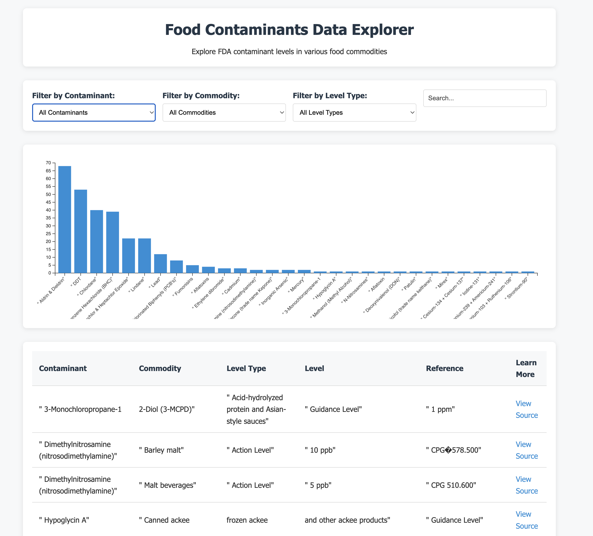

# Food Contaminants Data Explorer

An interactive web application for exploring FDA food contaminant data.



## Overview

This application provides a user-friendly interface to explore and visualize FDA contaminant levels in various food commodities. Users can filter the data, search for specific information, and view visualizations to better understand the relationships within the data.

## Features

- **Interactive Filtering**: Filter data by contaminant, commodity, and level type
- **Search Functionality**: Search across all data fields
- **Data Visualization**: View contaminant distribution in a bar chart
- **Responsive Design**: Works on desktop and mobile devices

## Getting Started

We offer two versions of this application:
1. A traditional web application using HTML/CSS/JavaScript
2. A Gradio-based Python application with enhanced filtering and visualization

### Prerequisites

- Python 3.7+ installed (required for the Gradio version)
- A modern web browser (Chrome, Firefox, Safari, or Edge)

### Installation and Setup

1. Clone this repository:
   ```bash
   git clone https://github.com/homer6/food-contaminants.git
   cd food-contaminants
   ```

2. Create and activate a Python virtual environment:
   ```bash
   # Create a virtual environment (use python3 on macOS/Linux if python command is not found)
   python -m venv venv
   # or
   python3 -m venv venv
   
   # Activate the virtual environment
   # On macOS/Linux:
   source venv/bin/activate
   # On Windows:
   venv\Scripts\activate
   ```

3. Install required dependencies:
   ```bash
   pip install -r requirements.txt
   ```

### Option 1: Run the Gradio Application (Recommended)

The Gradio application provides an enhanced user interface with better filtering options and interactive visualizations.

```bash
# Make sure your virtual environment is activated
python gradio_app.py
# or
python3 gradio_app.py
```

Open your browser and navigate to http://127.0.0.1:7860

#### Troubleshooting Visualization Issues

If you encounter any issues with visualizations not appearing in the full application:

```bash
# Run the simplified version to test basic visualization functionality
python3 simple_gradio_app.py
```

The simple version provides a minimal interface with just a bar chart of the top 10 contaminants, which can help diagnose whether the issue is with the visualization library or with the filter logic in the full application.

### Option 2: Run the Traditional Web Application

**IMPORTANT**: The traditional web application **cannot** be run by directly opening the HTML file in a browser due to CORS security restrictions. You **must** use a local web server.

Start a Python HTTP server (this will run until you stop it with Ctrl+C):
```bash
# Make sure your virtual environment is activated
# Start server on default port 8000
python -m http.server
# or
python3 -m http.server
```

Open your browser and navigate to http://localhost:8000

### Using the Application

#### Enhanced Gradio Interface
The Gradio application offers the following features:

1. **Advanced Filtering**
   - **Multi-select dropdowns**: Select multiple contaminants, commodities, or level types at once
   - Dropdown filters showing item counts for each option (e.g., "Lead (42)")
   - Full-text search across all data fields
   - Numeric filtering by minimum and maximum contaminant levels
   - One-click filter reset button

2. **Multiple Visualization Types**
   - Contaminant Distribution: Bar chart of most frequent contaminants
   - Commodity Distribution: Bar chart of most frequent food commodities
   - Level Type Distribution: Pie chart showing level type breakdown
   - Heatmap: Visualize relationships between contaminants and commodities
   - Level Type by Contaminant: Stacked bars showing level types for top contaminants

3. **Data Analysis Features**
   - Summary statistics dashboard for filtered data
   - Clean, paginated data table
   - Record count indicators and warnings for large result sets

4. **Interactive Experience**
   - Real-time updates when changing filters or visualization types
   - Responsive design that works on various screen sizes
   - Professional styling with modern typography and layout

When you're done, return to the terminal and press Ctrl+C to stop the server.

> **Note**: If you see an error like `Failed to load resource: net::ERR_FAILED` or `Access to fetch has been blocked by CORS policy`, it means you're trying to open the HTML file directly without using a web server.

## Data Source

Downloaded from FDA Chemical Contaminants Transparency Tool; http://hfpappexternal.fda.gov/scripts/fdcc/?set=contaminant-levels
- Last updated: 3/20/2025
- Downloaded: 3/22/2025

"Users of this table are encouraged to refer to the document listed in the reference column for additional explanation on how each contaminant level is applied."

Original source: https://www.hfpappexternal.fda.gov/scripts/fdcc/index.cfm?set=contaminant-levels

## License

See the [LICENSE](LICENSE) file for details.